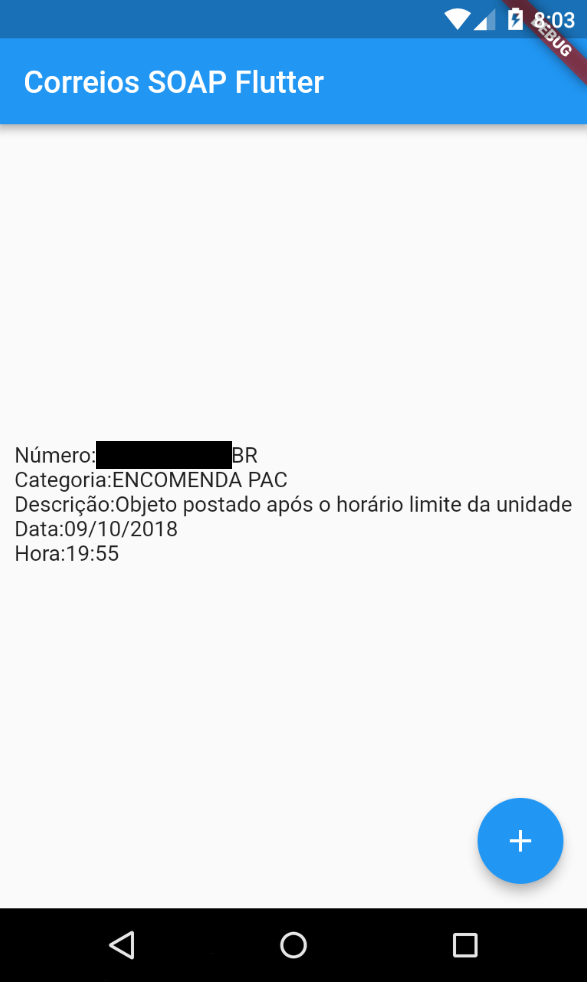

# Correios SOAP Flutter Simple App

App Flutter que consome API SOAP dos Correios  para obter dados de postagem de uma encomenda.

### Especificações

* [Flutter](https://flutter.io/) - v0.10.1 - Framework Mobile
* [Dart](https://www.dartlang.org/) - v2.1.0-dev.7.1.flutter - Linguagem
* [Android Studio](https://developer.android.com/studio/) - v3.2- IDE

### Configuração

